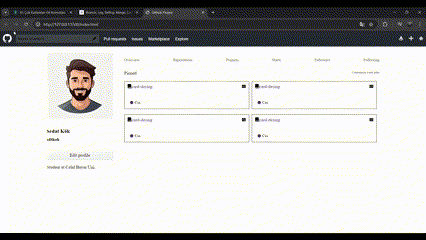

<h1>Github Klon</h1>

<h3>Github Profili </h3>

Git profili genelöolarak neler barındır.İçerisinde neler var genel olarak onları inceleyip birebir yapmaya çalıştık.

<h3>Kullanılan Yapılar</h3>

HTML,HTML5,CSS,CSS3 ve SCSS yapıları kullanılmıştır.

<h3>Ekran Görüntüsü</h3>

